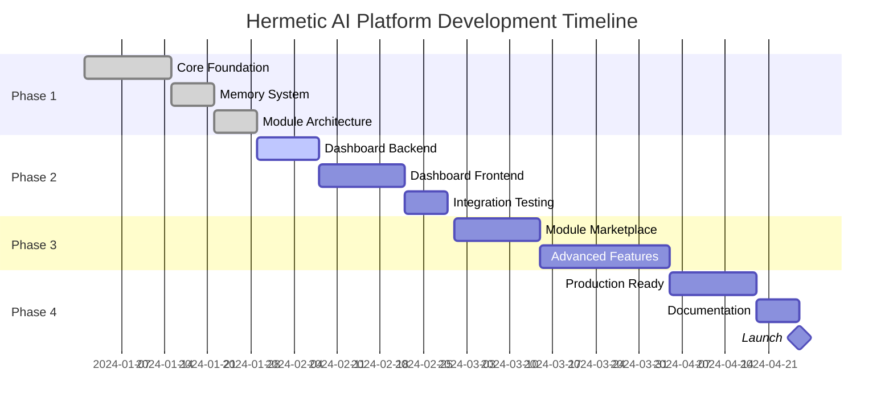

# 🗺️ Hermetic AI Platform - Development Roadmap

## Executive Summary

This roadmap outlines the complete development journey for the Hermetic AI Platform, from initial prototype to production-ready system with advanced features. The plan is divided into multiple phases with clear milestones, deliverables, and success metrics.

## Timeline Overview



## Phase 1: Core Platform Foundation ✅ (Weeks 1-4)

### Week 1-2: Foundation & Architecture
**Status**: ✅ COMPLETED

**Deliverables**:
- [x] Project structure and repository setup
- [x] Core platform module (`platform.py`)
- [x] Project auto-detection system
- [x] Sequential Thinking engine integration
- [x] LSP integration for code intelligence
- [x] Architecture blueprint documentation

**Key Components Implemented**:
```python
✅ HermeticAIPlatform       # Main orchestrator
✅ ProjectDetector          # Auto-detection logic
✅ SequentialThinkingEngine # Problem-solving
✅ LSPClient               # Code intelligence
✅ CodeIntelligence        # High-level code features
```

### Week 3: Memory System
**Status**: ✅ COMPLETED

**Deliverables**:
- [x] Dual-layer memory architecture
- [x] Universal memory storage (SQLite + FTS5)
- [x] Project-specific memory
- [x] Memory search and retrieval
- [x] Pattern promotion system

**Database Schema**:
```sql
✅ universal_memory.db
  - memories (FTS5)
  - error_patterns
  - command_library
  - architecture_patterns

✅ project_memory.db
  - project_memories (FTS5)
  - project_context
  - verification_history
  - documentation_requirements
```

### Week 4: Module System & Verification
**Status**: ✅ COMPLETED

**Deliverables**:
- [x] Module loader system
- [x] Module interface definition
- [x] Verification engine integration
- [x] Pattern checking and AST analysis
- [x] Security vulnerability detection
- [x] Sandbox execution environment

**Module Types Supported**:
```
✅ Builtin Modules  # Core platform modules
✅ External Modules # User-installed
✅ Community Modules # From marketplace
```

## Phase 2: Dashboard Development 🚧 (Weeks 5-8)

### Week 5-6: Backend Development
**Status**: 🚧 IN PROGRESS

**Planned Deliverables**:
- [ ] FastAPI server setup
- [ ] WebSocket implementation
- [ ] REST API endpoints
- [ ] Authentication system
- [ ] Module management API
- [ ] Memory exploration API
- [ ] Metrics collection system

**API Endpoints to Implement**:
```python
# Module Management
POST   /api/modules/install
DELETE /api/modules/uninstall
GET    /api/modules/list
PUT    /api/modules/configure

# Memory Operations
GET    /api/memory/search
POST   /api/memory/store
GET    /api/memory/context
POST   /api/memory/promote

# Tool Execution
POST   /api/tools/execute
GET    /api/tools/list
GET    /api/tools/status

# Project Management
GET    /api/projects/list
POST   /api/projects/activate
GET    /api/projects/info
```

### Week 7-8: Frontend Development
**Status**: ⏳ PLANNED

**Deliverables**:
- [ ] React application setup
- [ ] Module manager interface
- [ ] Workflow designer component
- [ ] Memory explorer interface
- [ ] Real-time monitoring dashboard
- [ ] Settings and configuration panel

**UI Components**:
```jsx
- <ModuleManager />      // Install, configure, manage
- <WorkflowDesigner />   // Visual tool orchestration
- <MemoryExplorer />     // Browse and search memories
- <MonitoringDashboard /> // Real-time metrics
- <SettingsPanel />      // Platform configuration
```

## Phase 3: Advanced Features 📋 (Weeks 9-12)

### Week 9-10: Module Marketplace
**Status**: ⏳ PLANNED

**Deliverables**:
- [ ] Module registry service
- [ ] Module submission system
- [ ] Version management
- [ ] Dependency resolution
- [ ] Security scanning
- [ ] Rating and review system

**Marketplace Features**:
```
- Browse available modules
- One-click installation
- Automatic updates
- Community contributions
- Module documentation
- Usage statistics
```

### Week 11-12: Enhanced Intelligence
**Status**: ⏳ PLANNED

**Deliverables**:
- [ ] Advanced pattern learning
- [ ] Cross-project insights
- [ ] Workflow templates
- [ ] Auto-optimization
- [ ] Performance profiling
- [ ] Advanced debugging tools

## Phase 4: Production Readiness 📦 (Weeks 13-14)

### Week 13: Testing & Optimization
**Status**: ⏳ PLANNED

**Deliverables**:
- [ ] Comprehensive test suite
- [ ] Performance optimization
- [ ] Security audit
- [ ] Load testing
- [ ] Error recovery testing
- [ ] Documentation review

**Testing Coverage**:
```
Unit Tests       > 80% coverage
Integration Tests > 70% coverage
E2E Tests        > 60% coverage
Performance      < 100ms latency
Memory          < 300MB footprint
```

### Week 14: Deployment & Launch
**Status**: ⏳ PLANNED

**Deliverables**:
- [ ] Installation script
- [ ] Docker containerization
- [ ] CI/CD pipeline
- [ ] Documentation website
- [ ] Video tutorials
- [ ] Launch announcement

## Milestones & Success Metrics

### Milestone 1: Core Platform Complete ✅
**Target**: Week 4
**Status**: ACHIEVED

**Metrics**:
- ✅ All core modules functional
- ✅ Memory system operational
- ✅ Project auto-detection working
- ✅ Verification engine integrated

### Milestone 2: Dashboard Alpha 🎯
**Target**: Week 8

**Success Criteria**:
- [ ] Dashboard accessible via browser
- [ ] All core features functional
- [ ] Real-time updates working
- [ ] Module management operational

### Milestone 3: Beta Release 🎯
**Target**: Week 12

**Success Criteria**:
- [ ] 10+ modules available
- [ ] 100+ beta users
- [ ] <100ms average response time
- [ ] Zero critical bugs

### Milestone 4: Production Launch 🎯
**Target**: Week 14

**Success Criteria**:
- [ ] Full documentation complete
- [ ] Installation <60 seconds
- [ ] 99.9% uptime target
- [ ] Community forum active

## Risk Management

### Technical Risks

1. **Language Server Compatibility**
   - **Risk**: LSP servers may not work uniformly
   - **Mitigation**: Implement fallback mechanisms

2. **Memory Performance**
   - **Risk**: SQLite may bottleneck at scale
   - **Mitigation**: Implement caching and pagination

3. **Module Security**
   - **Risk**: Malicious community modules
   - **Mitigation**: Sandboxing and code scanning

### Schedule Risks

1. **Dashboard Complexity**
   - **Risk**: UI development may take longer
   - **Mitigation**: Start with MVP features

2. **Integration Issues**
   - **Risk**: Claude Desktop compatibility
   - **Mitigation**: Early testing and feedback

## Resource Requirements

### Development Team
- **Core Developer**: Full-time (14 weeks)
- **Frontend Developer**: Weeks 7-8 (2 weeks)
- **QA Engineer**: Weeks 13-14 (2 weeks)
- **Documentation Writer**: Week 14 (1 week)

### Infrastructure
- **Development**: Local machines
- **Testing**: CI/CD pipeline (GitHub Actions)
- **Production**: Cloud hosting (optional)
- **Documentation**: Static site hosting

## Feature Prioritization

### Must Have (P0)
- ✅ Universal installation
- ✅ Project auto-detection
- ✅ Dual-layer memory
- ✅ Core modules (Sequential, LSP, Verification)
- 🚧 Basic dashboard
- ⏳ Installation script

### Should Have (P1)
- ⏳ Module marketplace
- ⏳ Workflow designer
- ⏳ Advanced monitoring
- ⏳ Cloud sync (optional)

### Nice to Have (P2)
- ⏳ IDE plugins
- ⏳ Team collaboration
- ⏳ Mobile dashboard
- ⏳ AI module generation

## Communication Plan

### Weekly Updates
- Progress against milestones
- Blockers and risks
- Next week's goals
- Demo of new features

### Community Engagement
- Discord/Slack channel
- GitHub discussions
- Weekly office hours
- Beta tester feedback

## Success Metrics

### Adoption Metrics
- **Week 4**: 10 internal users
- **Week 8**: 50 beta users
- **Week 12**: 200 beta users
- **Week 14**: 1000+ users

### Performance Metrics
- **Installation Time**: <60 seconds
- **Project Detection**: <100ms
- **Memory Query**: <50ms
- **Tool Execution**: <100ms overhead
- **Dashboard Load**: <1 second

### Quality Metrics
- **Code Coverage**: >80%
- **Bug Escape Rate**: <5%
- **User Satisfaction**: >4.5/5
- **Documentation Coverage**: 100%

## Post-Launch Roadmap

### Month 2-3
- Performance optimizations
- Additional language support
- Enterprise features
- Advanced analytics

### Month 4-6
- Team collaboration features
- Cloud-native deployment
- API gateway
- Plugin ecosystem

### Month 7-12
- Machine learning integration
- Predictive code completion
- Automated refactoring
- Cross-IDE support

## Dependencies

### External Dependencies
- **MCP SDK**: Model Context Protocol
- **Language Servers**: Various LSP implementations
- **Python**: 3.8+ required
- **Node.js**: For dashboard development
- **SQLite**: Database engine

### Internal Dependencies
- Sequential Thinking module
- LSP integration module
- Verification engine
- Memory system

## Budget Estimation

### Development Costs
- **Development Time**: 14 weeks × 40 hours = 560 hours
- **Testing/QA**: 2 weeks × 40 hours = 80 hours
- **Documentation**: 1 week × 40 hours = 40 hours
- **Total**: 680 hours

### Infrastructure Costs
- **Development**: $0 (local)
- **CI/CD**: $0 (GitHub Actions free tier)
- **Documentation**: $0 (GitHub Pages)
- **Optional Cloud**: $50-200/month

## Conclusion

This roadmap provides a clear path from the current state (Phase 1 complete) to a production-ready platform. The phased approach allows for iterative development, early user feedback, and risk mitigation. With core functionality already implemented, the focus shifts to user experience (dashboard) and ecosystem growth (marketplace).

The success of this platform depends on:
1. **Execution**: Staying on schedule with Phase 2-4
2. **Quality**: Maintaining high code and documentation standards
3. **Community**: Building an active user and developer community
4. **Innovation**: Continuing to push MCP architecture boundaries

---
*Roadmap Version: 1.0.0*
*Last Updated: 2024*
*Next Review: End of Phase 2*